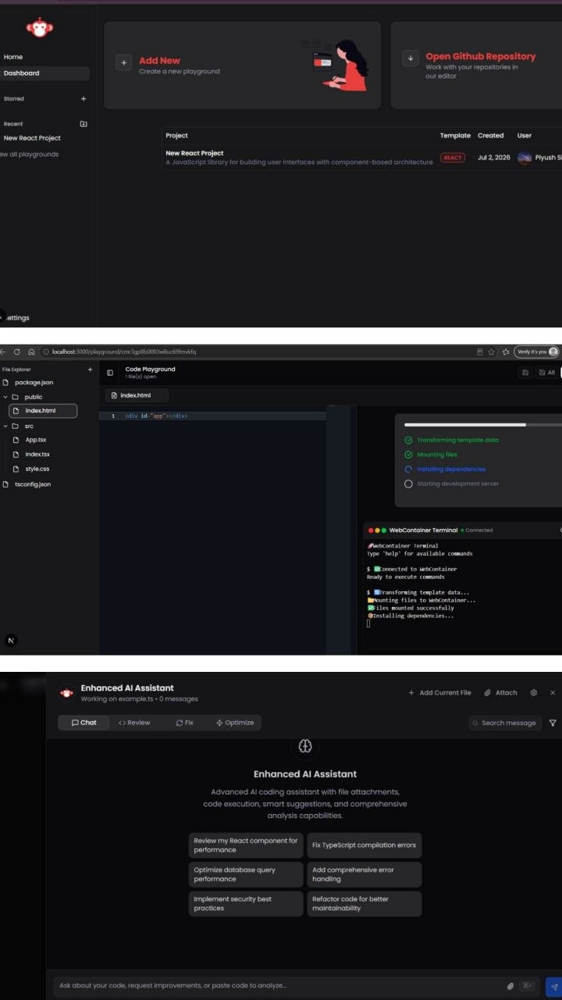

# VibeCode

A browser-native IDE that runs Node.js entirely inside the browser tab — no backend compute, no environment setup. Built with WebContainers, Monaco Editor, and local AI assistance via Ollama.

>  **Team project** — built by [Piyush](https://github.com/Piyush_253) · [Aditya](https://github.com/aditya-1104) · [Trayambak](https://github.com/HappyNoob0)

---
## 🎥 Project Demo

[▶ Watch Demo Video](https://github.com/aditya-1104/Web-Based-IDE/releases/download/v1.0.0/VibeCode.demo.mp4) 

---

### Home Page


### AI Code Workspace


---

## Features

- **Zero-setup execution** — Node.js runs in the browser via WebContainers (WASM). No Docker, no remote VM.
- **Real terminal** — xterm.js wired to a live bash shell inside the container. `npm install`, run scripts, everything works.
- **Monaco Editor** — the same editor that powers VS Code, with syntax highlighting and IntelliSense.
- **Virtual file system** — in-browser FS during the session, persisted to MongoDB on save.
- **AI code assistant** — local LLM via Ollama. Code never leaves your machine.
- **Real-time collaboration** — multiple users edit the same file simultaneously using Yjs CRDT.
- **Authentication** — NextAuth v5 with credential login and OAuth (Google/GitHub).
- **Project management** — create, save, and reload projects across sessions.

---

## Tech Stack

| Layer | Technology |
|---|---|
| Framework | Next.js 14 (App Router) |
| Editor | Monaco Editor |
| Terminal | xterm.js |
| Browser runtime | WebContainers (StackBlitz) |
| Auth | NextAuth v5 (JWT strategy) |
| Database | MongoDB + Prisma |
| Collaboration | Yjs + y-websocket + y-monaco |
| AI | Ollama (local LLM — codellama, llama3, etc.) |
| Language | TypeScript |

---

## Architecture

```
Browser Tab
├── Next.js App Router (UI)
│   ├── File Tree  ←→  WebContainers FS API
│   ├── Monaco Editor  ←→  y-monaco (Yjs CRDT binding)
│   └── xterm.js  ←→  WebContainers spawn() streams
│
├── WebContainers (WASM Worker)
│   ├── Node.js runtime
│   ├── Virtual file system
│   └── npm + shell
│
└── AI Sidebar  →  Ollama REST API (localhost:11434)

Server
├── NextAuth v5  →  MongoDB (users, accounts)
├── Project/File API  →  MongoDB (projects, files)
├── y-websocket server  →  MongoDB (ydocs — Yjs state)
└── Prisma ORM
```

---

## Database Schema

```
users         { _id, name, email, password?, image, createdAt }
accounts      { _id, userId, provider, providerAccountId, ... }  ← OAuth links
projects      { _id, name, userId, createdAt, updatedAt }
files         { _id, projectId, path, content, createdAt, updatedAt }
              index: { projectId: 1, path: 1 }, unique
ydocs         { _id, fileId, state: Binary, updatedAt }          ← Yjs CRDT state
```

---

## Getting Started

### Prerequisites

- Node.js 18+
- MongoDB instance (local or [MongoDB Atlas](https://www.mongodb.com/atlas))
- [Ollama](https://ollama.ai) installed and running (for AI features)
- Google/GitHub OAuth credentials (optional, for OAuth login)

### 1. Clone the repo

```bash
git clone https://github.com/aditya-1104/Web-Based-IDE.git
cd Web-Based-IDE
npm install
```

### 2. Set up environment variables

Create a `.env.local` file in the root:

```env
# Database
DATABASE_URL="mongodb+srv://<user>:<password>@cluster.mongodb.net/vibecode"

# NextAuth
NEXTAUTH_SECRET="your-secret-here"
NEXTAUTH_URL="http://localhost:3000"

# OAuth (optional)
GOOGLE_CLIENT_ID=""
GOOGLE_CLIENT_SECRET=""
GITHUB_CLIENT_ID=""
GITHUB_CLIENT_SECRET=""
```

### 3. Push Prisma schema

```bash
npx prisma db push
```

### 4. Set up Ollama (for AI features)

```bash
# Install from https://ollama.ai
ollama pull codellama   # or llama3, mistral, etc.
ollama serve            # starts API at localhost:11434
```

### 5. Run the dev server

```bash
npm run dev
```

Open [http://localhost:3000](http://localhost:3000).

---

## How WebContainers Work

WebContainers compiles a Node.js runtime to WebAssembly and runs it inside a browser Worker thread. This requires two HTTP headers on the IDE page to enable `SharedArrayBuffer`:

```
Cross-Origin-Opener-Policy: same-origin
Cross-Origin-Embedder-Policy: require-corp
```

These are set via Next.js middleware, scoped only to the `/ide` route to avoid breaking OAuth redirects on auth callback routes.

---

## AI Assistant

The AI sidebar calls Ollama's REST API at `localhost:11434/api/generate`. Responses stream token-by-token using the Fetch Streaming API.

**Supported models** (pull with `ollama pull <model>`):

| Model | Good for |
|---|---|
| `codellama` | Code generation, completion |
| `llama3` | General reasoning, explanation |
| `mistral` | Balanced — fast + capable |

No API key required. All inference runs locally.

---

## Limitations

- WebContainers supports Node.js projects only (no Python, Java, etc.)
- npm packages with native addons may not install in the browser runtime
- AI features require Ollama running locally — cloud LLM fallback is a planned addition
- One WebContainers instance per browser origin (page reload required to switch projects)

---
